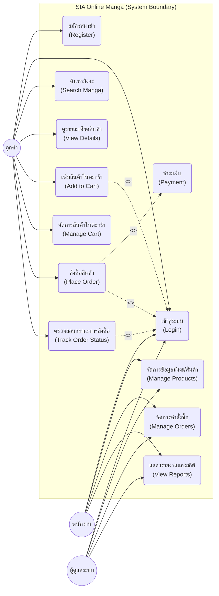
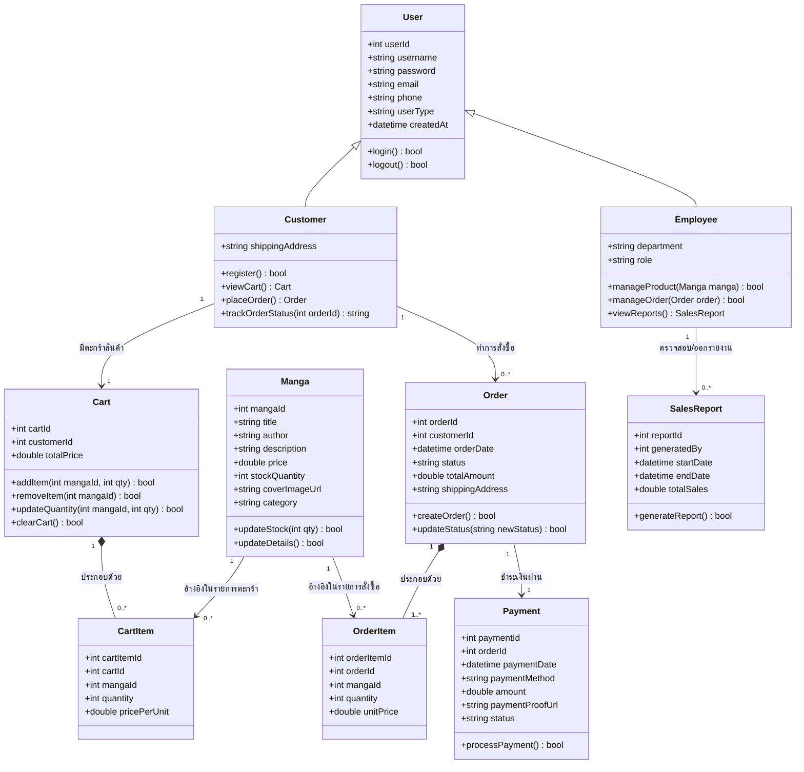
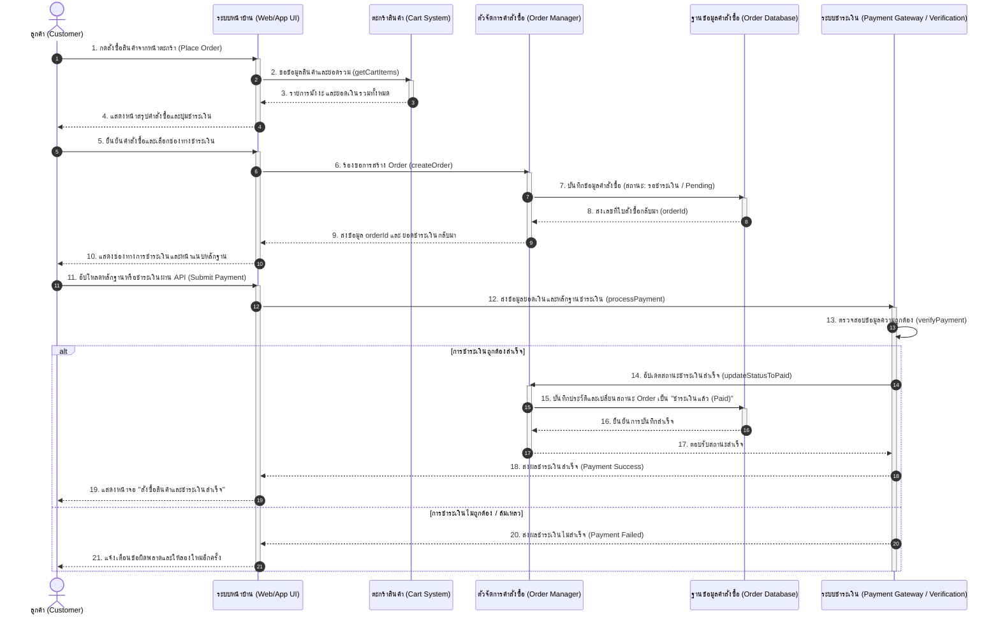

# SIA Online Manga (ระบบจำหน่ายมังงะออนไลน์)
โปรเจกต์ระบบจำหน่ายการ์ตูน/มังงะออนไลน์ในรูปแบบ **E-commerce Platform** ครบวงจร ที่ออกแบบมาเพื่อให้ลูกค้าเลือกซื้อหนังสือมังงะที่ต้องการได้อย่างง่ายดาย พร้อมระบบจัดการหลังบ้านที่มีประสิทธิภาพสำหรับพนักงานและผู้ดูแลระบบ
---
## 👥 สมาชิกทีมพัฒนา (Team Members)
* **นาย เมธวิน ปิติสกุลรัตน์**
* **นาย พงศภัค ผิวทอง**
* **นาย ชัยวัฒน์ ธนวัฒน์สิริกุล**
---
## 🎨 ตัวอย่างหน้าจอระบบ (UI Mockup)
หน้าหลักของระบบจำหน่ายมังงะออนไลน์สไตล์ **Dark Mode + Glassmorphism** ทันสมัย เน้นการแสดงผลการ์ดมังงะโปร่งแสงและการไล่โทนสีทองแดง (Copper) ตัดกับสีดำชาร์โคล

---
## ⚙️ ขอบเขตการให้บริการของระบบ (System Scope)
ระบบแบ่งขอบเขตและฟังก์ชันการทำงานหลักออกเป็น 5 ส่วนสำคัญ:
1. **ระบบสมัครสมาชิกและเข้าสู่ระบบ (Membership & Authentication)**
   * การสมัครสมาชิกสำหรับลูกค้าใหม่ (Register)
   * การเข้าสู่ระบบของ ลูกค้า, พนักงาน และผู้ดูแลระบบ (Login)
2. **ระบบแสดงรายงานและค้นหา (Search & Report System)**
   * ค้นหามังงะตามชื่อ เรื่อง หรือหมวดหมู่ (Search Manga)
   * ดูรายละเอียดสินค้า ราคา และสต็อกสินค้า (View Details)
   * แสดงรายงานยอดขาย สถิติการใช้งาน และหน้าเว็บที่ดาวน์โหลดช้าสำหรับพนักงาน/ผู้ดูแลระบบ (View Reports)
3. **ระบบตะกร้าสินค้า (Shopping Cart System)**
   * เพิ่มสินค้าลงในตะกร้าชั่วคราว (Add to Cart)
   * จัดการสินค้า แก้ไขจำนวน หรือลบมังงะในตะกร้า (Manage Cart)
4. **ระบบสั่งซื้อและชำระเงิน (Order & Payment System)**
   * ดำเนินการสั่งซื้อสินค้าจากตะกร้า (Place Order)
   * การชำระเงินแนบสลิป หรือชำระผ่าน API ช่องทางต่างๆ (Payment)
   * ติดตามและตรวจสอบสถานะการจัดส่งสินค้า (Track Order Status)
5. **ระบบจัดการสินค้าและคำสั่งซื้อ (Management System)**
   * การเพิ่ม/ลบ/แก้ไขข้อมูลมังงะและจำนวนสต็อกคงเหลือ (Manage Products)
   * การอนุมัติการชำระเงินและตรวจสอบสถานะใบสั่งซื้อ (Manage Orders)
---
## 📊 แผนภาพการทำงานของระบบ (System Diagrams)
> [!NOTE]
> GitHub รองรับการแสดงผลรูปภาพไดอะแกรมด้านล่างนี้ผ่าน Mermaid Syntax โดยอัตโนมัติ
### 1. แผนภาพยูสเคส (Use Case Diagram)
แสดงปฏิสัมพันธ์ระหว่างผู้ใช้ (Actors) ทั้ง 3 กลุ่มกับฟังก์ชันหลักของระบบ

---
### 2. แผนภาพคลาส (Class Diagram)
แสดงโครงสร้างฐานข้อมูล ความสัมพันธ์เชิงวัตถุ (Inheritance, Composition, Association) ของระบบ

---
### 3. แผนภาพลำดับขั้นตอน (Sequence Diagrams)
#### 3.1 ขั้นตอนการสั่งซื้อและชำระเงิน (Ordering & Payment Flow)

---
## 🛠️ ข้อตกลงระดับการบริการและการบำรุงรักษา (SLA & Maintenance Plan)
### ระดับความรุนแรงของปัญหาและการตอบกลับ (SLA)
* **ระดับ 1**: ระบบล่ม ไม่สามารถเข้าเว็บได้ 
  * *การตอบกลับ*: ภายใน 15 นาที / แก้ไขให้เสร็จสิ้นภายใน 2 ชั่วโมง
* **ระดับ 2**: ไม่สามารถ Login ได้ / ชำระเงินไม่ได้ 
  * *การตอบกลับ*: ภายใน 1 ชั่วโมง / แก้ไขให้เสร็จสิ้นภายใน 6 ชั่วโมง
* **ระดับ 3**: รูปภาพสินค้าไม่ขึ้น ค้นหาสินค้าไม่พบ 
  * *การตอบกลับ*: ภายใน 4 ชั่วโมง / แก้ไขให้เสร็จสิ้นภายใน 24 ชั่วโมง
* **ระดับ 4**: ไม่สามารถแก้ไขข้อความหรือรูปภาพประกอบย่อยได้ 
  * *การตอบกลับ*: ภายใน 12 ชั่วโมง / แก้ไขให้เสร็จสิ้นภายใน 3 วัน
### แผนการบำรุงรักษา (Maintenance Schedule)
* **ทุกวัน**: เคลียร์แคชของระบบ และตรวจสอบสถานะความเสถียรของ API สำหรับช่องทางการชำระเงิน
* **ทุกสัปดาห์**: จัดระเบียบและปรับปรุงประสิทธิภาพของฐานข้อมูล, อัปเดตแพตช์ความปลอดภัยซอฟต์แวร์ระบบ และทดสอบระบบตรวจสอบบัญชีความปลอดภัยของผู้ใช้
* **ทุกเดือน**: อัปเดตและเช็คความถูกต้องของรายการการ์ตูนที่จะออกใหม่ประจำสัปดาห์ และตรวจวิเคราะห์หาสาเหตุหน้าเว็บที่ดาวน์โหลดช้าเกินขีดจำกัดมาตรฐาน
