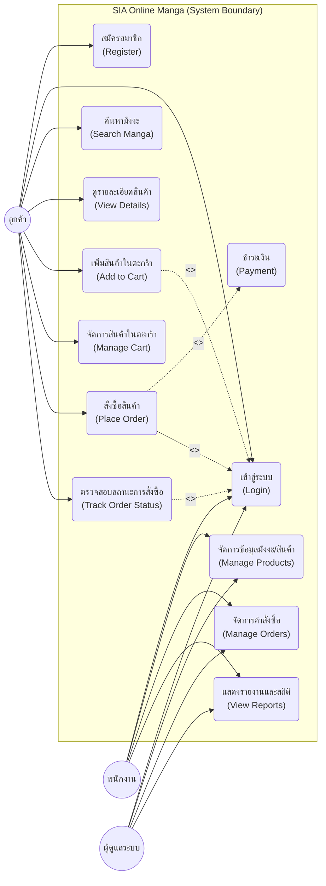
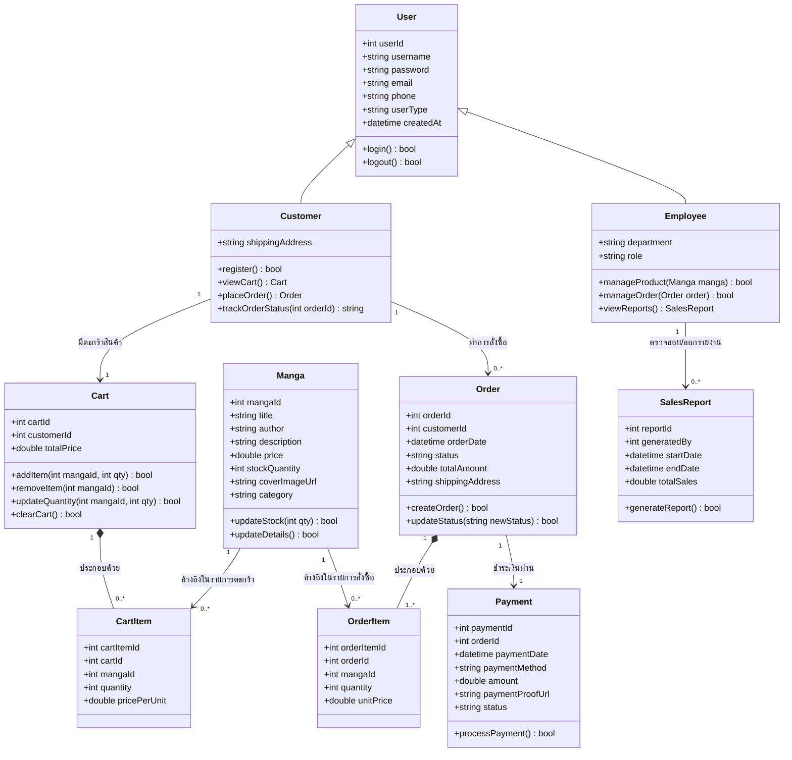
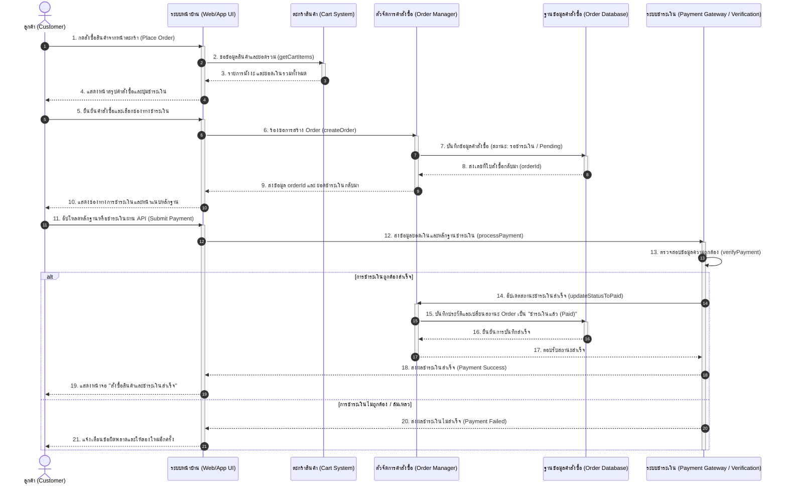

# SIA Online Manga (ระบบจำหน่ายมังงะออนไลน์)
โปรเจกต์ระบบจำหน่ายการ์ตูน/มังงะออนไลน์ในรูปแบบ **E-commerce Platform** ครบวงจร ที่ออกแบบมาเพื่อให้ลูกค้าเลือกซื้อหนังสือมังงะที่ต้องการได้อย่างง่ายดาย พร้อมระบบจัดการหลังบ้านที่มีประสิทธิภาพสำหรับพนักงานและผู้ดูแลระบบ
---
## 📖 1. หลักการและเหตุผล (Background & Rationale)
ในยุคปัจจุบันที่เทคโนโลยีก้าวหน้าและอินเทอร์เน็ตเข้ามาเป็นส่วนหนึ่งของชีวิตประจำวัน พฤติกรรมการบริโภคสื่อบันเทิงของคนรุ่นใหม่ โดยเฉพาะ "มังงะ (Manga)" หรือการ์ตูนญี่ปุ่น ได้เปลี่ยนจากการซื้อรูปแบบเล่มกระดาษแบบดั้งเดิมไปสู่ช่องทางออนไลน์ที่รวดเร็วและเข้าถึงง่ายมากขึ้น
อย่างไรก็ตาม ผู้ใช้บริการระบบจำหน่ายออนไลน์ทั่วไปมักประสบปัญหาต่างๆ เช่น ระบบค้นหาสินค้าที่ไม่แม่นยำ ขั้นตอนการสั่งซื้อที่ซับซ้อน ความล่าช้าในการตรวจสอบสถานะคำสั่งซื้อ ตลอดจนความไม่มั่นคงปลอดภัยในการทำธุรกรรมชำระเงิน ในขณะเดียวกัน ฝั่งผู้ดูแลระบบก็มักขาดเครื่องมือหลังบ้านที่มีประสิทธิภาพในการบริหารจัดการสต็อกสินค้าและการติดตามรายการคำสั่งซื้ออย่างเป็นระบบ
คณะผู้จัดทำจึงได้เล็งเห็นถึงโอกาสในการพัฒนา **"ระบบจำหน่ายมังงะออนไลน์ (SIA Online Manga)"** ขึ้น เพื่อแก้ไขปัญหาดังกล่าว โดยพัฒนาแพลตฟอร์มร้านค้าที่ทันสมัย ใช้งานสะดวก ปลอดภัย และมีประสิทธิภาพสูงตามหลัก SLA (Service Level Agreement) ที่ชัดเจน เพื่อตอบสนองความพึงพอใจสูงสุดของผู้อ่าน และช่วยลดข้อผิดพลาดในการดำเนินงานของพนักงาน
---
## 🎯 2. วัตถุประสงค์ของโครงงาน (Project Objectives)
1. เพื่อออกแบบและพัฒนาระบบจำหน่ายมังงะออนไลน์สไตล์ E-commerce ที่ใช้งานง่าย มีฟังก์ชันตะกร้าสินค้า สั่งซื้อสินค้า และช่องทางการชำระเงินที่รวดเร็วและปลอดภัยสำหรับลูกค้า
2. เพื่อพัฒนาแผงจัดการหลังบ้าน (Back-office panel) ที่ช่วยให้พนักงานสามารถแก้ไขข้อมูลมังงะ ตรวจสอบสต็อก และอัปเดตสถานะคำสั่งซื้อของลูกค้าได้อย่างมีประสิทธิภาพ
3. เพื่อสร้างระบบจัดทำรายงานวิเคราะห์ยอดขายและประสิทธิภาพหน้าเว็บสำหรับพนักงานและผู้ดูแลระบบในการติดตามการทำงาน
4. เพื่อศึกษา พัฒนา และติดตั้งระบบที่มีเสถียรภาพและคุณภาพบริการสอดคล้องตามข้อตกลงระดับบริการ (SLA) และแผนการซ่อมบำรุงที่กำหนดไว้
---
## 👥 3. โครงสร้างทีมและบทบาทหน้าที่ (Team Structure & Roles Allocation)
เพื่อประสิทธิภาพสูงสุดในการดำเนินการ สมาชิกในทีมได้รับการแบ่งสัดส่วนความรับผิดชอบหลักตามสายงาน (Role-based) ดังนี้:
* **นาย เมธวิน ปิติสกุลรัตน์ (Project Manager / System Analyst)**
  * *บทบาทหน้าที่*: บริหารจัดการเวลาของโปรเจกต์ วาดแผนภาพโครงสร้างระบบ (Use Case, Class Diagram, Sequence Diagram) รวบรวมความต้องการของระบบ (Requirements) และดูแลขอบเขตการทำงานร่วมกันนน
* **นาย พงศภัค ผิวทอง (Full-stack Developer)**
  * *บทบาทหน้าที่*: ออกแบบและเขียนโค้ดหน้าบ้าน (Frontend UI/UX) ตามแบบ Mockup เชื่อมโยงกับ Backend API ออกแบบฟังก์ชันระบบชำระเงินและตะกร้าสินค้า รวมถึงจัดการระบบความปลอดภัยของบัญชีผู้ใช้งาน
* **นาย ชัยวัฒน์ ธนวัฒน์สิริกุล (Database Administrator / QA Tester)**
  * *บทบาทหน้าที่*: ออกแบบความสัมพันธ์ของฐานข้อมูล (Database Schema) ตรวจสอบความถูกต้องและปรับปรุงความเร็วการคิวรีข้อมูล ทำการทดสอบระบบ (Manual & Automated Testing) และจัดทำรายงานเมื่อพบปัญหาการใช้งาน
---
## 🎨 4. ตัวอย่างหน้าจอระบบ (UI Mockup)
หน้าหลักของระบบจำหน่ายมังงะออนไลน์สไตล์ **Dark Mode + Glassmorphism** ทันสมัย เน้นการแสดงผลการ์ดมังงะโปร่งแสงและการไล่โทนสีทองแดง (Copper) ตัดกับสีดำชาร์โคล

---
## ⚙️ 5. ขอบเขตของระบบ (System Scope)
ระบบแบ่งขอบเขตและสิทธิ์ของกลุ่มผู้ใช้งานออกเป็น 3 กลุ่มหลัก ดังนี้:
### 5.1 ขอบเขตสำหรับลูกค้า (Customer Area)
* **สมัครสมาชิก (Register)**: ลงทะเบียนเพื่อสร้างบัญชีผู้ใช้ใหม่ในระบบ
* **เข้าสู่ระบบ (Login)**: ยืนยันตัวตนเข้าสู่ระบบก่อนทำรายการซื้อขายหรือดูประวัติส่วนตัว
* **ค้นหามังงะและดูรายละเอียด (Search & View Details)**: ค้นหามังงะตามชื่อ เรื่อง นักเขียน หรือหมวดหมู่ พร้อมแสดงราคา จำนวนคงเหลือ และหน้าปก
* **จัดการตะกร้าสินค้า (Cart Management)**: เลือกมังงะใส่ตะกร้า แก้ไขจำนวนมังงะ หรือคัดสินค้าที่ไม่ต้องการออก
* **สั่งซื้อและชำระเงิน (Order & Payment)**: สั่งซื้อหนังสือมังงะ แนบหลักฐานการโอนเงินหรือชำระผ่านระบบ Payment Gateway
* **ตรวจสอบสถานะ (Track Status)**: ติดตามสถานะจัดส่งสินค้าหรือประวัติคำสั่งซื้อของตนเอง
### 5.2 ขอบเขตสำหรับพนักงาน (Staff Area)
* **จัดการข้อมูลมังงะ (Manage Products)**: เพิ่ม แก้ไข และลบข้อมูลหนังสือมังงะ อัปเดตราคา สต็อก และหมวดหมู่
* **จัดการคำสั่งซื้อ (Manage Orders)**: ตรวจสอบหลักฐานการชำระเงิน อนุมัติออเดอร์ และอัปเดตสถานะจัดส่งสินค้า
* **ดูสถิติและรายงาน (View Reports)**: ดูรายงานสรุปยอดขายรายวัน/รายเดือนเพื่อใช้บริหารจัดส่งสินค้าได้ง่ายขึ้น
### 5.3 ขอบเขตสำหรับผู้ดูแลระบบ (Admin Area)
* **จัดการข้อมูลของระบบ**: สิทธิ์เข้าถึงและจัดการข้อมูลทุกส่วนเทียบเท่าพนักงาน พร้อมทั้งจัดการสิทธิ์การเข้าถึงของบัญชีพนักงานในระบบ
* **แสดงรายงานเชิงลึก (Advanced Reports)**: ดูรายงานสถิติประสิทธิภาพการโหลดเว็บ สถิติการเกิดข้อผิดพลาดของระบบ และความมั่นคงปลอดภัยเพื่อดำเนินการซ่อมบำรุงตาม SLA
---
## 🛠️ 6. เครื่องมือและเทคโนโลยีที่ใช้ (Tools & Technologies)
* **Frontend**: HTML5, Vanilla CSS (เพื่อควบคุมสไตล์สถาปัตยกรรมแบบ Custom), Modern JavaScript (ES6+), React/Vite
* **Backend**: Node.js & Express.js
* **Database**: PostgreSQL (สอดคล้องตามโครงสร้างข้อมูลเชิงสัมพันธ์ใน Class Diagram)
* **Design & Collaboration**: Figma (สำหรับออกแบบ UI และ Wireframe), Miro (สำหรับจัดทำ Diagrams)
* **Testing Tools**: Postman (สำหรับทดสอบ API endpoint), Jest (สำหรับทำ Unit Test), Cypress (สำหรับทำ End-to-End Test)
* **Version Control & Deploy**: Git & GitHub, Render (สำหรับ Deploy Server), Vercel (สำหรับ Deploy Frontend)
---
## 🧪 7. แนวทางการทดสอบระบบ (System Testing Guidelines)
เพื่อรับประกันความเสถียรและป้องกันความเสียหายของระบบ ทีมงานกำหนดแนวทางการทดสอบดังนี้:
1. **Unit Testing**: เขียนสคริปต์ทดสอบฟังก์ชันย่อยทีละโมดูลด้วย **Jest** เช่น ฟังก์ชันการตรวจสอบรูปแบบรหัสผ่านการสมัครสมาชิก, การคำนวณภาษีและค่าส่งในหน้าตะกร้าสินค้า
2. **Integration Testing**: ทดสอบการไหลของข้อมูลและการทำงานร่วมกันระหว่าง API และฐานข้อมูล เช่น เมื่อมีการเปลี่ยนสถานะการจ่ายเงินเป็น "ชำระเงินแล้ว" ระบบจะต้องทำการลดจำนวนมังงะในตารางสต็อก (Stock Count) โดยอัตโนมัติ
3. **End-to-End (E2E) Testing**: ทดสอบการเดินทางของผู้ใช้งานจริงตั้งแต่ต้นจนจบ (User Journey) ผ่านโปรแกรม **Cypress** เพื่อทดสอบว่าผู้ใช้อื่นๆ สามารถทำรายการชำระเงินและสมัครใช้งานได้สมบูรณ์ในทุกขั้นตอน
4. **User Acceptance Testing (UAT)**: ทำแบบฟอร์มการทดสอบจำลอง (Test Case Matrix) เพื่อให้กลุ่มตัวอย่างทดลองใช้งานระบบและแจ้งบั๊ก เพื่อประเมินความสอดคล้องตามความต้องการและขอบเขตงานก่อนส่งมอบจริง
---
## 📊 8. แผนภาพการทำงานของระบบ (System Diagrams)
> [!NOTE]
> GitHub รองรับการแสดงผลรูปภาพไดอะแกรมด้านล่างนี้ผ่าน Mermaid Syntax โดยอัตโนมัติ
### 8.1 แผนภาพยูสเคส (Use Case Diagram)

### 8.2 แผนภาพคลาส (Class Diagram)

### 8.3 แผนภาพลำดับขั้นตอนการสั่งซื้อและชำระเงิน (Ordering & Payment Sequence Flow)

---
## 🎯 9. ผลลัพธ์ที่คาดว่าจะได้รับ (Expected Outcomes)
1. ได้รับระบบ e-commerce จำหน่ายมังงะออนไลน์ต้นแบบ (Prototype) ที่มีความมั่นคงปลอดภัยและเสถียรตามเงื่อนไขข้อตกลง SLA
2. พนักงานขายสามารถบันทึกข้อมูลมังงะ อัปเดตราคา สินค้าคงคลัง และตรวจสอบหลักฐานการโอนเงินเพื่อจัดเตรียมสินค้าได้อย่างแม่นยำ
3. ผู้ดูแลระบบและผู้บริหารร้านสามารถตรวจสอบและนำข้อมูลสถิติ/รายงานยอดขายของร้านไปทำการตลาดเพื่อเพิ่มรายได้ในอนาคตได้อย่างถูกต้อง
4. สมาชิกในกลุ่มผู้พัฒนาได้เรียนรู้ขั้นตอนการทำงานและการประสานงานพัฒนาโปรเจกต์ซอฟต์แวร์เสมือนการทำงานจริงในระดับองค์กร
---
## 🛠️ 10. ข้อตกลงระดับการบริการและการบำรุงรักษา (SLA & Maintenance Plan)
### ระดับความรุนแรงของปัญหาและการตอบกลับ (SLA)
* **ระดับ 1**: ระบบล่ม ไม่สามารถเข้าเว็บได้ 
  * *การตอบกลับ*: ภายใน 15 นาที / แก้ไขให้เสร็จสิ้นภายใน 2 ชั่วโมง
* **ระดับ 2**: ไม่สามารถ Login ได้ / ชำระเงินไม่ได้ 
  * *การตอบกลับ*: ภายใน 1 ชั่วโมง / แก้ไขให้เสร็จสิ้นภายใน 6 ชั่วโมง
* **ระดับ 3**: รูปภาพสินค้าไม่ขึ้น ค้นหาสินค้าไม่พบ 
  * *การตอบกลับ*: ภายใน 4 ชั่วโมง / แก้ไขให้เสร็จสิ้นภายใน 24 ชั่วโมง
* **ระดับ 4**: ไม่สามารถแก้ไขข้อความหรือรูปภาพประกอบย่อยได้ 
  * *การตอบกลับ*: ภายใน 12 ชั่วโมง / แก้ไขให้เสร็จสิ้นภายใน 3 วัน
### แผนการบำรุงรักษา (Maintenance Schedule)
* **ทุกวัน**: เคลียร์แคชของระบบ และตรวจสอบสถานะความเสถียรของ API สำหรับช่องทางการชำระเงิน
* **ทุกสัปดาห์**: จัดระเบียบและปรับปรุงประสิทธิภาพของฐานข้อมูล, อัปเดตแพตช์ความปลอดภัยซอฟต์แวร์ระบบ และทดสอบระบบตรวจสอบบัญชีความปลอดภัยของผู้ใช้
* **ทุกเดือน**: อัปเดตและเช็คความถูกต้องของรายการการ์ตูนที่จะออกใหม่ประจำสัปดาห์ และตรวจวิเคราะห์หาสาเหตุหน้าเว็บที่ดาวน์โหลดช้าเกินขีดจำกัดมาตรฐาน
---
